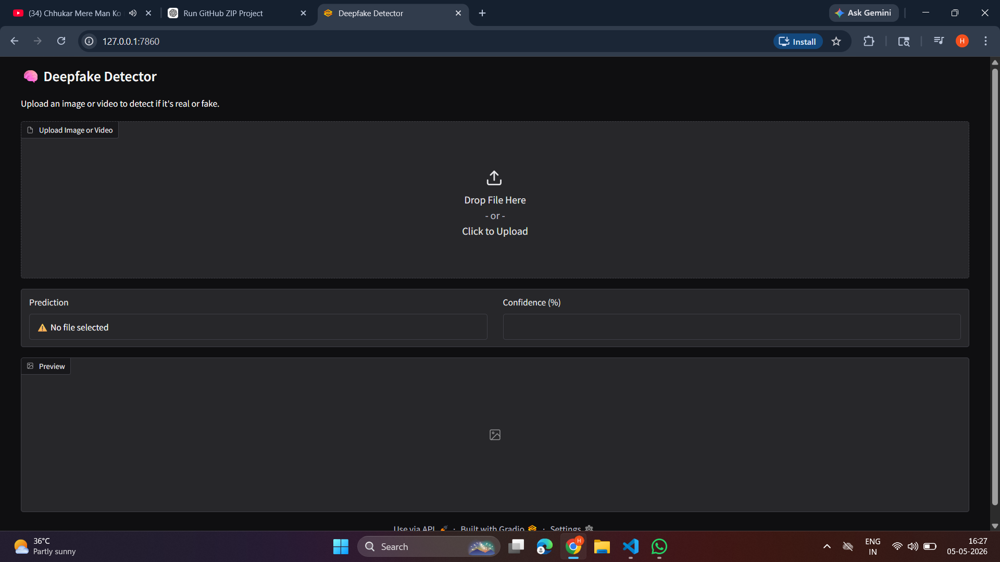
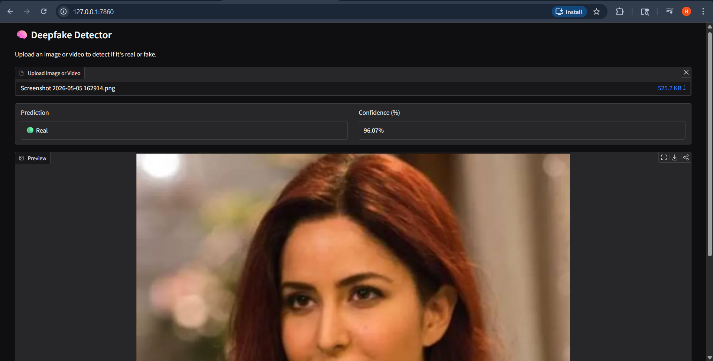

# 🧠 Deepfake Detection System Using EfficientNet-B0 and Deep Learning

A deep learning-based web application that detects whether an uploaded image or video is **Real** or **Fake (Deepfake)** using the EfficientNet-B0 architecture and PyTorch.

This project was developed as a **University Mini Project** with a focus on practical implementation of AI-based media forensics using Deep Learning.

---

## 👨‍💻 Project Team

- Heenal Jain
- Harshwardhan Singh Sengar
- Harshwardhan Singh Pawar

---

## 🌟 Features

- ✅ Deepfake detection using EfficientNet-B0
- ✅ Supports both image and video inputs
- ✅ Interactive Gradio-based web interface
- ✅ Real-time prediction with confidence score
- ✅ PyTorch deep learning implementation
- ✅ Simple and user-friendly UI
- ✅ ONNX export support
- ✅ Training and inference pipeline included

---

## 🛠️ Technologies Used

- Python
- PyTorch
- PyTorch Lightning
- EfficientNet-B0
- OpenCV
- Gradio
- NumPy
- ONNX

---

## 📸 Application Screenshots

### 🔹 Home Interface



### 🔹 Prediction Result



---

## 🚀 How to Run the Project

### 1️⃣ Clone the Repository

```bash
git clone https://github.com/Heenaljain21/DeepfakeDetector.git
cd DeepfakeDetector
```

---

### 2️⃣ Create Virtual Environment

```bash
python -m venv venv
```

Activate virtual environment:

#### Windows

```bash
venv\Scripts\activate
```

#### Linux/Mac

```bash
source venv/bin/activate
```

---

### 3️⃣ Install Dependencies

```bash
pip install -r requirements.txt
```

---

### 4️⃣ Run the Web Application

```bash
python web-app.py
```

After running, open:

```text
http://127.0.0.1:7860
```

---

## 📂 Project Structure

```text
DeepfakeDetector/
│
├── web-app.py
├── classify.py
├── main_trainer.py
├── config.yaml
├── requirements.txt
├── README.md
│
├── models/
│   └── best_model-v3.pt
│
├── datasets/
│   └── hybrid_loader.py
│
├── lightning_modules/
│   └── detector.py
│
├── inference/
│   ├── export_onnx.py
│   └── video_inference.py
│
├── tools/
│   ├── split_dataset.py
│   ├── split_train_val.py
│   └── export_to_pt.py
│
└── data/
    ├── train/
    └── validation/
```

---

## 🧠 Model Architecture

- **Model Used:** EfficientNet-B0
- **Framework:** PyTorch
- **Input Size:** 224 × 224 RGB Images
- **Output Classes:** Real / Fake
- **Loss Function:** CrossEntropyLoss
- **Optimizer:** Adam Optimizer

---

## 📊 Dataset Structure

```text
data/
├── train/
│   ├── real/
│   └── fake/
│
└── validation/
    ├── real/
    └── fake/
```

---

## 🏋️ Model Training

To train the model:

```bash
python main_trainer.py
```

Training configurations can be modified in:

```text
config.yaml
```

---

## 🎥 Supported Formats

### Images
- JPG
- JPEG
- PNG

### Videos
- MP4
- MOV

---

## 📈 Future Improvements

- Improve model accuracy using larger datasets
- Add live webcam deepfake detection
- Deploy using Streamlit/Flask cloud hosting
- Add multi-frame video analysis
- Improve UI design and responsiveness

---

## 📚 Applications

- Social media content verification
- Fake media detection
- Cybersecurity and digital forensics
- News/media authentication
- AI-generated media analysis

---

## 🙏 Acknowledgement

This project was developed for educational and research purposes in the field of Deep Learning and AI-based Deepfake Detection.

---

## 📄 License

This project is intended for academic and educational use.

---

⭐ If you found this project useful, consider giving it a star on GitHub.